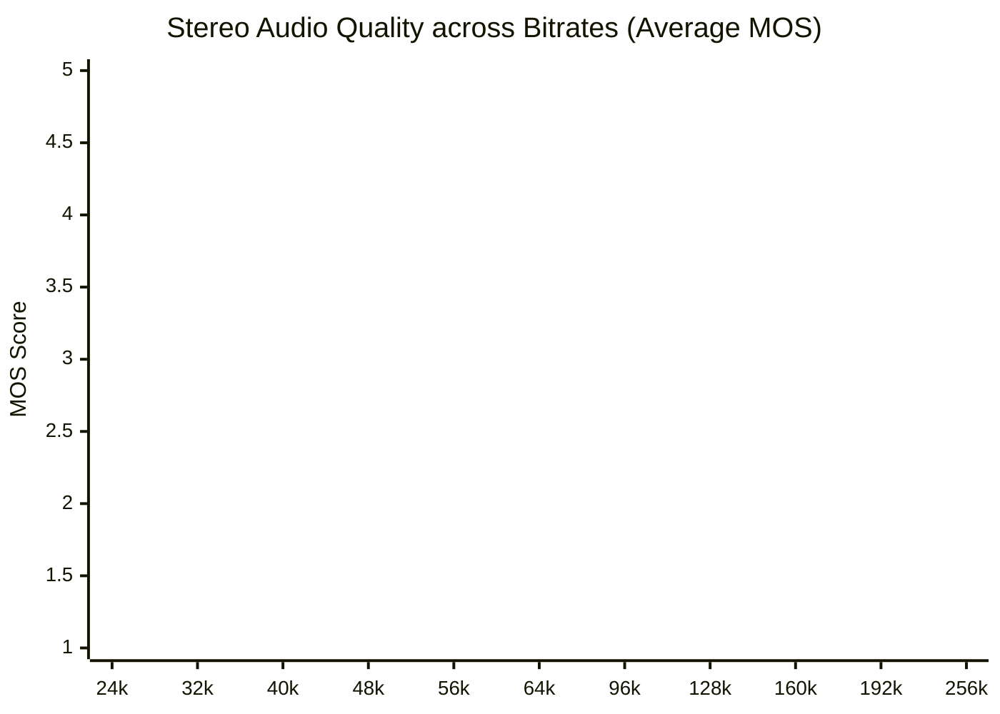
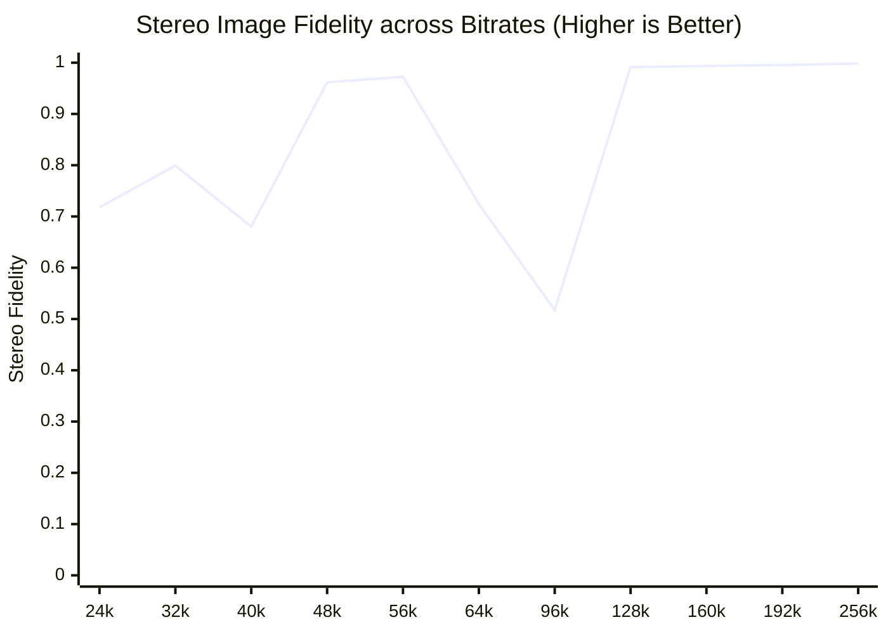
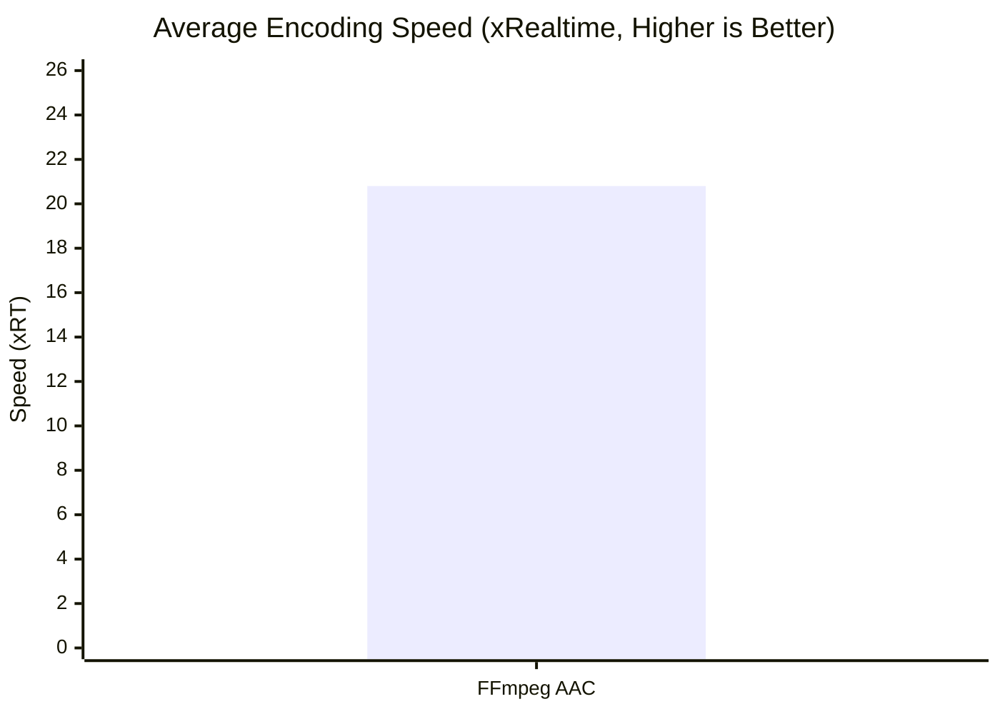
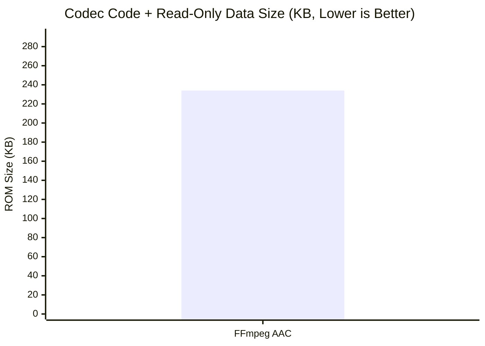

# AAC Encoder Leaderboard

Quality scores are objective proxy estimates (Zimtohrli/ViSQOL), not blind ABX listening test results.

## Overall Rankings

| Rank | Encoder | Status | Worst MOS | Overall MOS | Scenarios | Stereo Fidelity | Transient Fidelity | Speed (xRT) | Bitrate Error | ROM (Flash) |
| :--- | :--- | :---: | :---: | :---: | :---: | :---: | :---: | :---: | :---: | :---: |
| 1 | FFmpeg AAC | OK | 0.000 | 0.000 | 13/13 | **0.8502** | **0.6779** | **20.8x** | **8.7%** | 234.0 KB |

## Per-Scenario Breakdown & Visualizations

### Stereo Audio Quality Across Bitrates



<details><summary><b>View Detailed Stereo Audio Average & Worst MOS Tables</b></summary>

#### Per-Scenario Average MOS (Stereo Audio)

#### Per-Scenario Worst MOS (Min Clip MOS - Stereo Audio)

> **Note**: Minimum perceptual MOS score observed across any clip in the scenario. Highlights edge-case clip degradation.

</details>

### Mono Speech Quality Across Bitrates

```mermaid
xychart-beta
    title "Mono Speech Quality across Bitrates (Average MOS)"
    x-axis ["16k", "40k"]
    y-axis "MOS Score" 1.0 --> 5.0
    line "FFmpeg AAC" [0.0, 0.0]
```

<details><summary><b>View Detailed Mono Speech Average & Worst MOS Tables</b></summary>

#### Per-Scenario Average MOS (Mono Speech)

#### Per-Scenario Worst MOS (Min Clip MOS - Mono Speech)

> **Note**: Minimum perceptual MOS score observed across any clip in the scenario. Highlights edge-case clip degradation.

</details>

### Stereo Image Fidelity

> **Note**: Measured as 1.0 - |Coherence(Ref) - Coherence(Deg)|. **Higher is truer** (closer to reference stereo image).



<details><summary><b>View Detailed Stereo Fidelity Table</b></summary>

#### LC Profile

| Scenario | FFmpeg AAC |
| :--- | :---: |
| 48k_stereo_24k | **0.7180** ██████░░ |
| 48k_stereo_32k | **0.7992** ██████░░ |
| 48k_stereo_40k | **0.6801** █████░░░ |
| 48k_stereo_48k | **0.9617** ████████ |
| 48k_stereo_56k | **0.9725** ████████ |
| 48k_stereo_64k | **0.7246** ██████░░ |
| 48k_stereo_96k | **0.5174** ████░░░░ |
| 48k_stereo_128k | **0.9914** ████████ |
| 48k_stereo_160k | **0.9935** ████████ |
| 48k_stereo_192k | **0.9954** ████████ |
| 48k_stereo_256k | **0.9981** ████████ |

</details>

### Transient Fidelity

> **Note**: Measured as 1 / (1 + mean |attack-centroid-shift| ms) across onsets. **Higher is truer** (attack timing closer to reference).

<details><summary><b>View Detailed Transient Fidelity Table</b></summary>

#### LC Profile

| Scenario | FFmpeg AAC |
| :--- | :---: |
| 16k_mono_16k | N/A |
| 16k_mono_40k | N/A |
| 48k_stereo_24k | **0.5152** ████░░░░ |
| 48k_stereo_32k | **0.5089** ████░░░░ |
| 48k_stereo_40k | **0.5139** ████░░░░ |
| 48k_stereo_48k | **0.8084** ██████░░ |
| 48k_stereo_56k | **0.8462** ███████░ |
| 48k_stereo_64k | **0.6086** █████░░░ |
| 48k_stereo_96k | **0.4681** ████░░░░ |
| 48k_stereo_128k | **0.9332** ███████░ |
| 48k_stereo_160k | **0.9546** ████████ |
| 48k_stereo_192k | **0.9656** ████████ |
| 48k_stereo_256k | **0.9776** ████████ |

</details>

### Bitrate Accuracy (Error %)

> **Note**: Deviation from target bitrate. **Lower is Better**.

<details><summary><b>View Detailed Bitrate Accuracy Table</b></summary>

#### LC Profile

| Scenario | FFmpeg AAC |
| :--- | :---: |
| 16k_mono_16k | **18.2%** █░░░░░░░ |
| 16k_mono_40k | **19.8%** ░░░░░░░░ |
| 48k_stereo_24k | **15.0%** ██░░░░░░ |
| 48k_stereo_32k | **4.9%** ██████░░ |
| 48k_stereo_40k | **4.6%** ██████░░ |
| 48k_stereo_48k | **5.3%** ██████░░ |
| 48k_stereo_56k | **5.3%** ██████░░ |
| 48k_stereo_64k | **4.8%** ██████░░ |
| 48k_stereo_96k | **3.9%** ██████░░ |
| 48k_stereo_128k | **7.8%** █████░░░ |
| 48k_stereo_160k | **8.3%** █████░░░ |
| 48k_stereo_192k | **7.8%** █████░░░ |
| 48k_stereo_256k | **7.3%** █████░░░ |

</details>

### Encoder Efficiency & Footprint

#### Encoding Speed (xRT)



#### Codec ROM (Flash) Size



<details><summary><b>View Detailed Per-Scenario Efficiency Table</b></summary>

#### LC Profile

| Scenario | FFmpeg AAC |
| :--- | :---: |
| 16k_mono_16k | **56.2x** ████████ |
| 16k_mono_40k | **42.7x** ██████░░ |
| 48k_stereo_24k | **19.1x** ███░░░░░ |
| 48k_stereo_32k | **17.4x** ██░░░░░░ |
| 48k_stereo_40k | **16.6x** ██░░░░░░ |
| 48k_stereo_48k | **15.2x** ██░░░░░░ |
| 48k_stereo_56k | **16.0x** ██░░░░░░ |
| 48k_stereo_64k | **15.7x** ██░░░░░░ |
| 48k_stereo_96k | **14.6x** ██░░░░░░ |
| 48k_stereo_128k | **14.6x** ██░░░░░░ |
| 48k_stereo_160k | **13.8x** ██░░░░░░ |
| 48k_stereo_192k | **13.1x** ██░░░░░░ |
| 48k_stereo_256k | **15.1x** ██░░░░░░ |

</details>


---
**Metric Legend**:
- **Ranking**: by Worst MOS, then Overall MOS as tiebreaker.
- **Quality (MOS)**: Perceptual audio quality (1-5, **Higher is Better**)
- **Stereo Fidelity**: Faithfulness of stereo image (0-1, **Higher is Better**)
- **Transient Fidelity**: How little attacks are smeared/delayed (0-1, **Higher is Better**)
- **Speed**: Encoding throughput (**Higher is Better**)
- **Bitrate Error**: Deviation from target bitrate (**Lower is Better**)
- **ROM (Flash)**: Codec code + read-only data size (**Lower is Better**)
