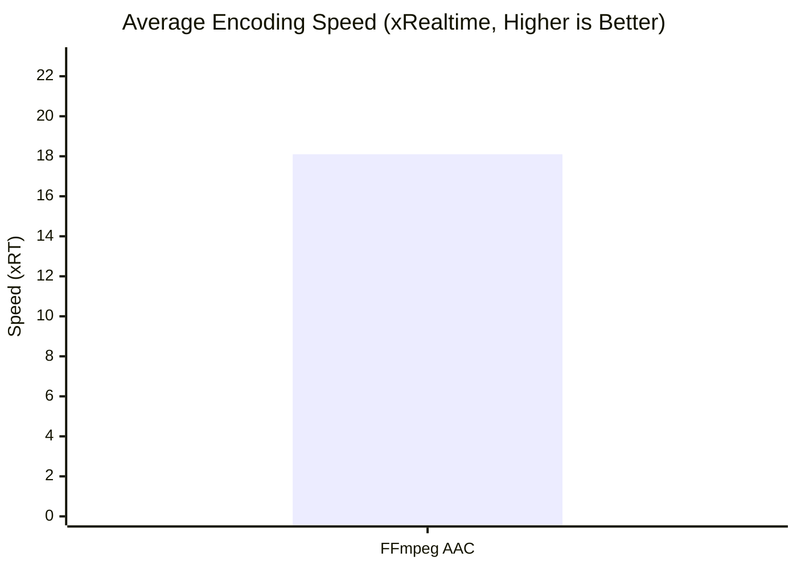
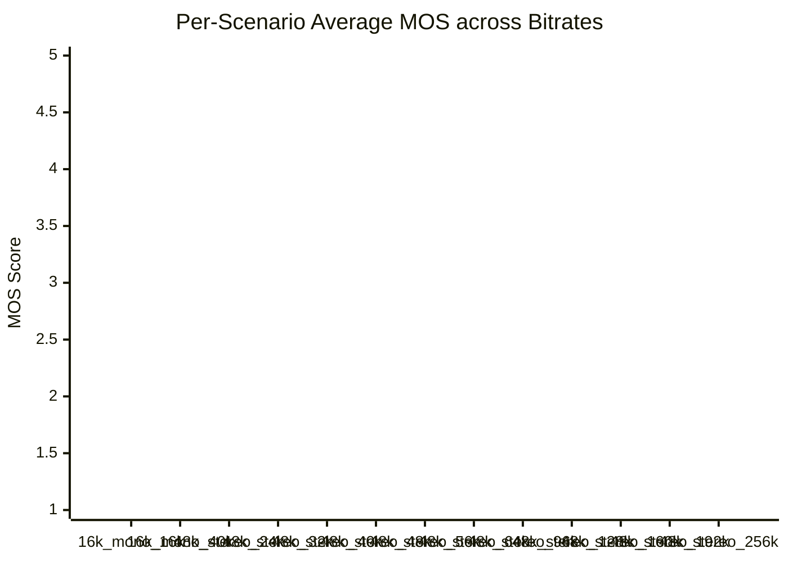

# AAC Encoder Leaderboard

Quality scores are objective proxy estimates (Zimtohrli/ViSQOL), not blind ABX listening test results.

## Overall Rankings

| Rank | Encoder | Status | Worst MOS | Overall MOS | Scenarios | Stereo Fidelity | Transient Fidelity | Speed (xRT) | Bitrate Error | ROM (Flash) |
| :--- | :--- | :---: | :---: | :---: | :---: | :---: | :---: | :---: | :---: | :---: |
| 1 | FFmpeg AAC | OK | 0.000 | 0.000 | 13/13 | **0.9543** | **0.8372** | **18.1x** | **8.7%** | 234.0 KB |

## Visualizations

### Overall MOS vs Worst MOS

```mermaid
xychart-beta
    title "Overall MOS vs. Worst MOS (Higher is Better)"
    x-axis ["FFmpeg AAC"]
    y-axis "MOS Score" 1.0 --> 5.0
    bar [0.000]
    line [0.000]
```

### Encoding Speed (xRT)



### Quality Across Bitrates (Average MOS)




<details><summary><b>View Per-Scenario Quality, Stereo & Efficiency Breakdown</b></summary>

### Per-Scenario Average MOS

#### LC Profile

| Scenario | FFmpeg AAC |
| :--- | :---: |
| 16k_mono_16k | N/A |
| 16k_mono_40k | N/A |
| 48k_stereo_24k | N/A |
| 48k_stereo_32k | N/A |
| 48k_stereo_40k | N/A |
| 48k_stereo_48k | N/A |
| 48k_stereo_56k | N/A |
| 48k_stereo_64k | N/A |
| 48k_stereo_96k | N/A |
| 48k_stereo_128k | N/A |
| 48k_stereo_160k | N/A |
| 48k_stereo_192k | N/A |
| 48k_stereo_256k | N/A |


### Per-Scenario Worst MOS (Min Clip MOS)

> **Note**: Minimum perceptual MOS score observed across any clip in the scenario. Highlights edge-case clip degradation.

#### LC Profile

| Scenario | FFmpeg AAC |
| :--- | :---: |
| 16k_mono_16k | N/A |
| 16k_mono_40k | N/A |
| 48k_stereo_24k | N/A |
| 48k_stereo_32k | N/A |
| 48k_stereo_40k | N/A |
| 48k_stereo_48k | N/A |
| 48k_stereo_56k | N/A |
| 48k_stereo_64k | N/A |
| 48k_stereo_96k | N/A |
| 48k_stereo_128k | N/A |
| 48k_stereo_160k | N/A |
| 48k_stereo_192k | N/A |
| 48k_stereo_256k | N/A |


### Per-Scenario Stereo Fidelity

> **Note**: Measured as 1.0 - |Coherence(Ref) - Coherence(Deg)|. **Higher is truer** (closer to reference stereo image).

#### LC Profile

| Scenario | FFmpeg AAC |
| :--- | :---: |
| 16k_mono_16k | N/A |
| 16k_mono_40k | N/A |
| 48k_stereo_24k | **0.7794** |
| 48k_stereo_32k | **0.8999** |
| 48k_stereo_40k | **0.9425** |
| 48k_stereo_48k | **0.9617** |
| 48k_stereo_56k | **0.9725** |
| 48k_stereo_64k | **0.9751** |
| 48k_stereo_96k | **0.9877** |
| 48k_stereo_128k | **0.9914** |
| 48k_stereo_160k | **0.9935** |
| 48k_stereo_192k | **0.9954** |
| 48k_stereo_256k | **0.9981** |


### Per-Scenario Transient Fidelity

> **Note**: Measured as 1 / (1 + mean |attack-centroid-shift| ms) across onsets. **Higher is truer** (attack timing closer to reference).

#### LC Profile

| Scenario | FFmpeg AAC |
| :--- | :---: |
| 16k_mono_16k | N/A |
| 16k_mono_40k | N/A |
| 48k_stereo_24k | **0.6585** |
| 48k_stereo_32k | **0.6967** |
| 48k_stereo_40k | **0.7507** |
| 48k_stereo_48k | **0.8084** |
| 48k_stereo_56k | **0.8462** |
| 48k_stereo_64k | **0.8591** |
| 48k_stereo_96k | **0.9160** |
| 48k_stereo_128k | **0.9332** |
| 48k_stereo_160k | **0.9546** |
| 48k_stereo_192k | **0.9656** |
| 48k_stereo_256k | **0.9776** |


### Per-Scenario Bitrate Accuracy (Error %)

> **Note**: Deviation from target bitrate. **Lower is Better**.

#### LC Profile

| Scenario | FFmpeg AAC |
| :--- | :---: |
| 16k_mono_16k | **18.2%** |
| 16k_mono_40k | **19.8%** |
| 48k_stereo_24k | **15.0%** |
| 48k_stereo_32k | **4.9%** |
| 48k_stereo_40k | **4.6%** |
| 48k_stereo_48k | **5.3%** |
| 48k_stereo_56k | **5.3%** |
| 48k_stereo_64k | **4.8%** |
| 48k_stereo_96k | **3.9%** |
| 48k_stereo_128k | **7.8%** |
| 48k_stereo_160k | **8.3%** |
| 48k_stereo_192k | **7.8%** |
| 48k_stereo_256k | **7.3%** |


### Per-Scenario Efficiency (Speed xRT)

> **Note**: Encoding throughput relative to real-time. **Higher is Better**.

#### LC Profile

| Scenario | FFmpeg AAC |
| :--- | :---: |
| 16k_mono_16k | **43.8x** |
| 16k_mono_40k | **34.2x** |
| 48k_stereo_24k | **16.2x** |
| 48k_stereo_32k | **14.7x** |
| 48k_stereo_40k | **13.5x** |
| 48k_stereo_48k | **14.6x** |
| 48k_stereo_56k | **15.4x** |
| 48k_stereo_64k | **14.9x** |
| 48k_stereo_96k | **14.0x** |
| 48k_stereo_128k | **13.9x** |
| 48k_stereo_160k | **13.1x** |
| 48k_stereo_192k | **12.8x** |
| 48k_stereo_256k | **14.5x** |


</details>

---
**Metric Legend**:
- **Ranking**: by Worst MOS, then Overall MOS as tiebreaker.
- **Quality (MOS)**: Perceptual audio quality (1-5, **Higher is Better**)
- **Stereo Fidelity**: Faithfulness of stereo image (0-1, **Higher is Better**)
- **Transient Fidelity**: How little attacks are smeared/delayed (0-1, **Higher is Better**)
- **Speed**: Encoding throughput (**Higher is Better**)
- **Bitrate Error**: Deviation from target bitrate (**Lower is Better**)
- **ROM (Flash)**: Codec code + read-only data size (**Lower is Better**)
