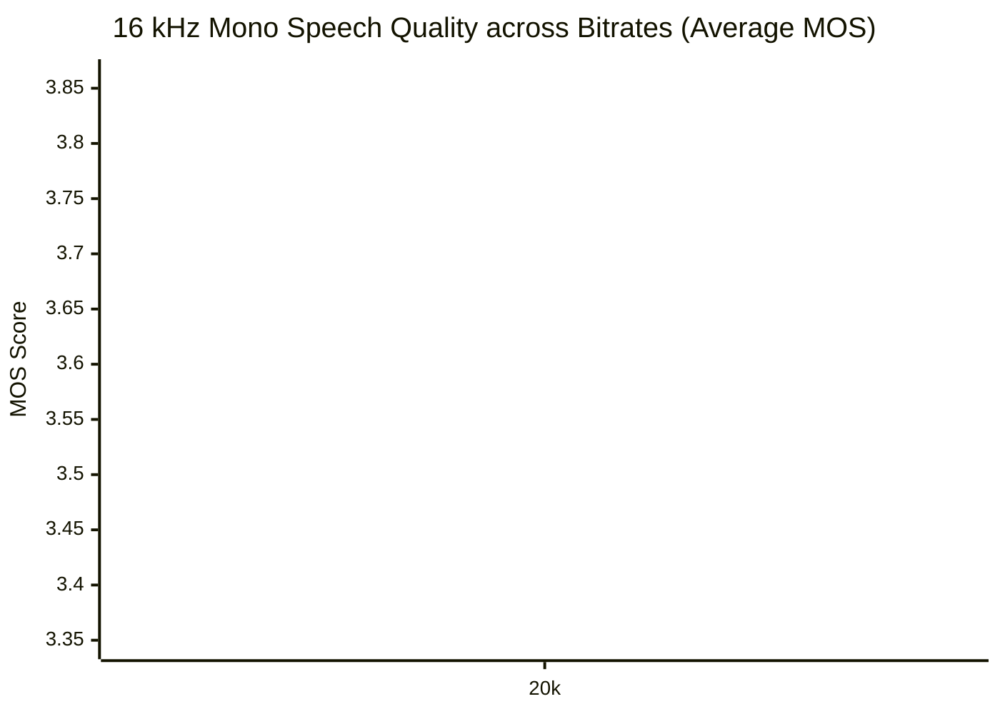
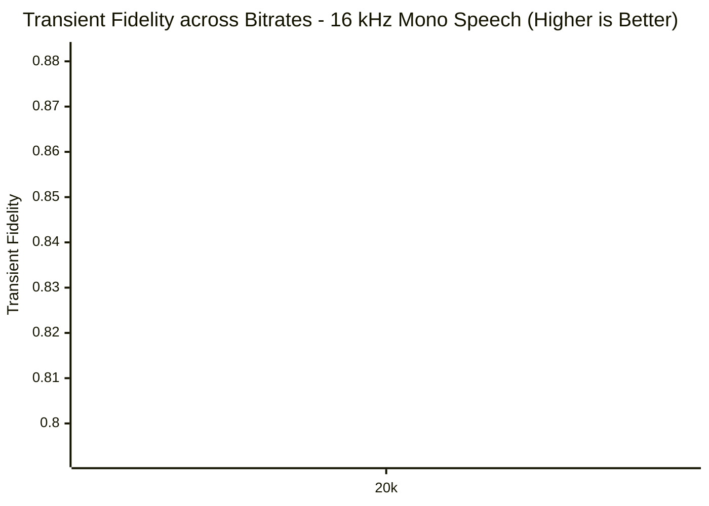
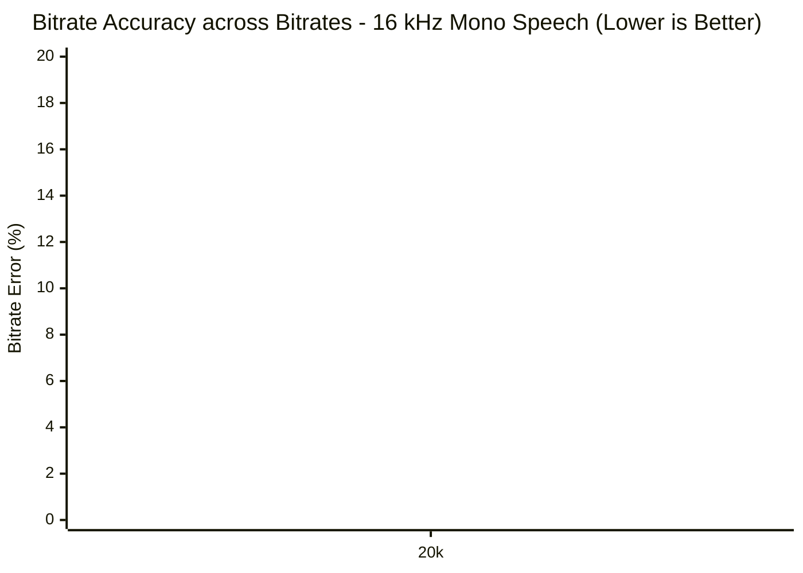
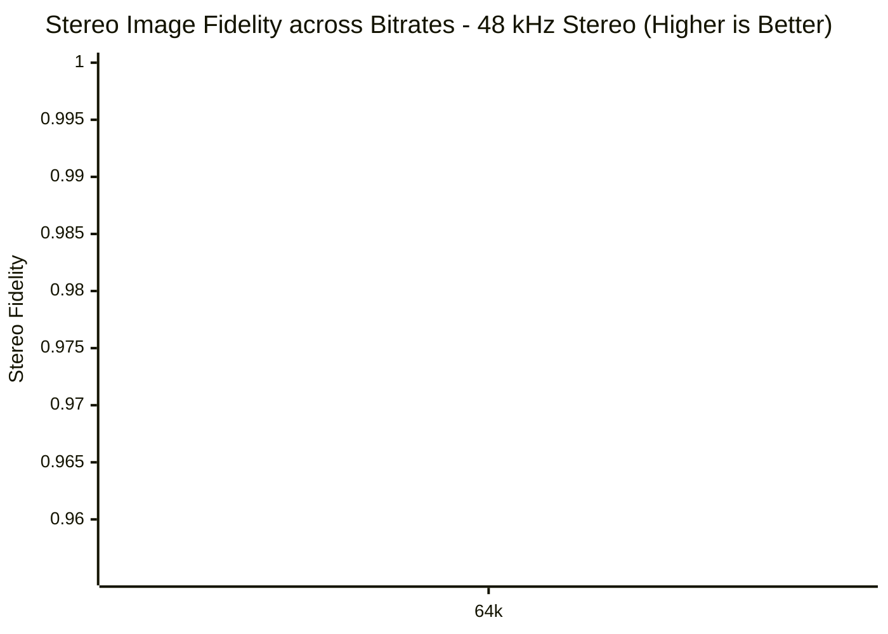
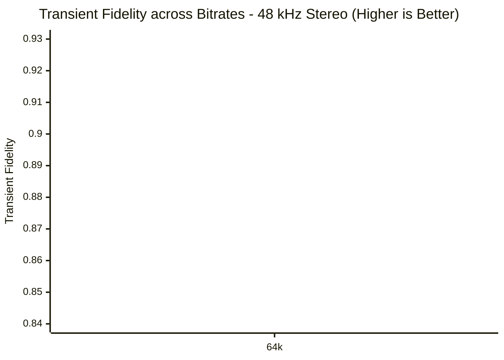
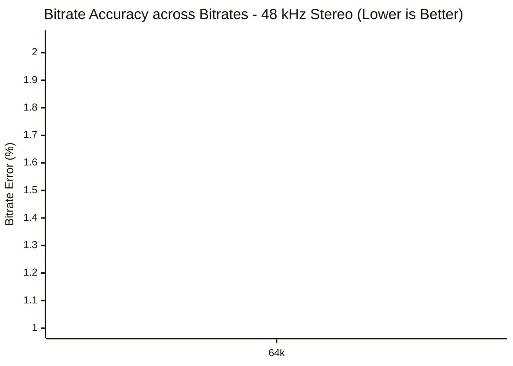
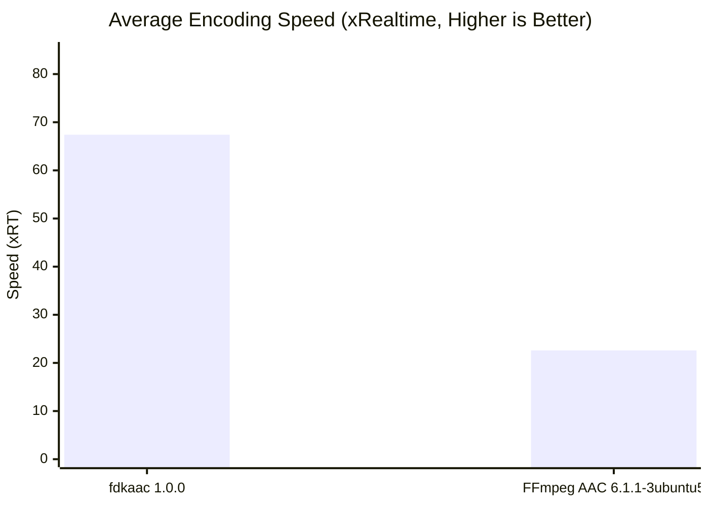
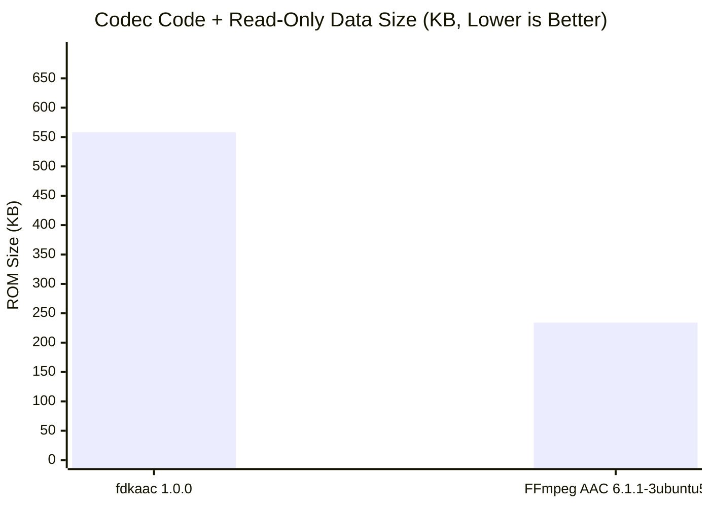
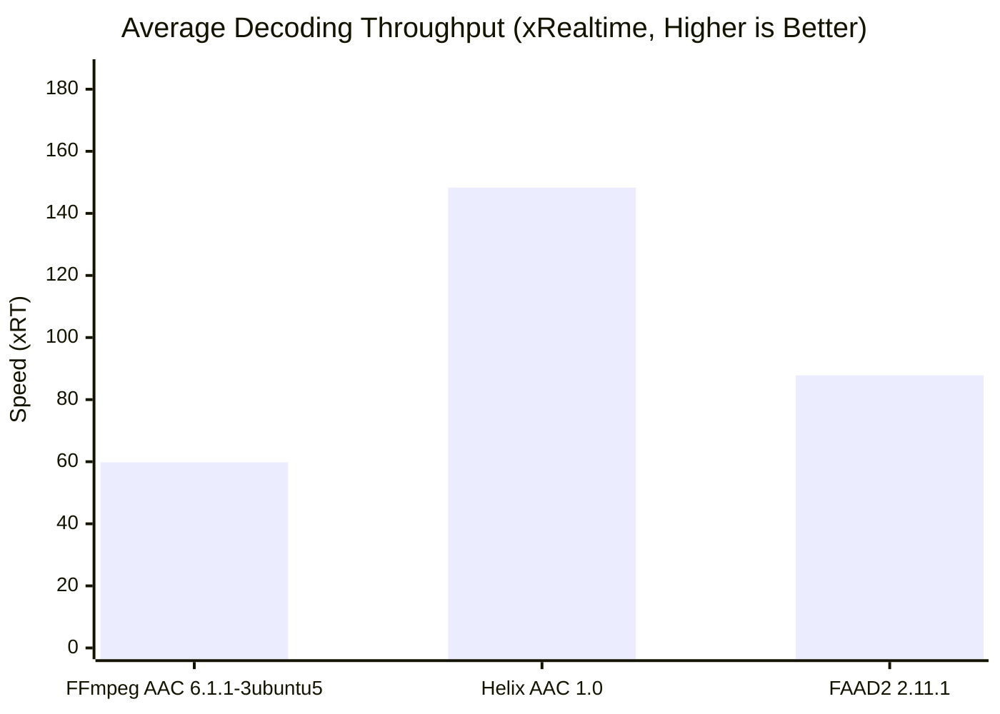

# 🎛️ Audio Codec Leaderboard

[🎙️ Encoder Rankings](#encoder-leaderboard) | [🔊 Decoder Rankings](#decoder-leaderboard) | [📋 Encoder Breakdowns](#per-scenario-encoder-breakdowns) | [📋 Decoder Breakdowns](#per-scenario-decoder-breakdowns)

---

<a name="encoder-leaderboard"></a>
## 🎙️ Encoder Leaderboard

Quality scores are objective proxy estimates (Zimtohrli/ViSQOL), not blind ABX listening test results.

### Overall Encoder Rankings

> **Note**: Overall MOS averages the scenario set listed below, so absolute values are only comparable between leaderboards built from the same set of scenarios. Relative ranking is unaffected.

| Rank | Encoder | Status | Worst MOS | Overall MOS | Scenarios | Stereo Fidelity | Transient Fidelity | Speed (xRT) | Bitrate Error | Peak RAM | ROM (Flash) |
| :--- | :--- | :---: | :---: | :---: | :---: | :---: | :---: | :---: | :---: | :---: | :---: |
| 🏆 1 | fdkaac 1.0.0 | OK | **3.512** | **4.007** | 2/2 | **0.9821** | **0.8861** | **67.4x** | **1.8%** | 12.0 MB | 558.1 KB |
| 2 | FFmpeg AAC 6.1.1-3ubuntu5 | OK | 3.157 | 3.602 | 2/2 | 0.9751 | 0.8350 | 22.6x | 15.8% | 54.0 MB | 234.0 KB |

<a name="per-scenario-encoder-breakdowns"></a>
<details><summary><b>📊 View Per-Scenario Breakdowns & Visualizations</b></summary>

## Per-Scenario Breakdown & Visualizations

### 16 kHz Mono Speech Quality Across Bitrates



<details><summary><b>View Detailed 16 kHz Mono Speech Average & Worst MOS Tables</b></summary>

#### Per-Scenario Average MOS (16 kHz Mono Speech)

#### LC Profile

| Scenario | fdkaac 1.0.0 | FFmpeg AAC 6.1.1-3ubuntu5 |
| :--- | :---: | :---: |
| 16k_mono_20k | **3.786** ██████░░ | 3.423 █████░░░ |

#### Per-Scenario Worst MOS (Min Clip MOS - 16 kHz Mono Speech)

> **Note**: Minimum perceptual MOS score observed across any clip in the scenario. Highlights edge-case clip degradation. A 🐛 names the clip when every other encoder scored ≥0.75 MOS higher on that exact clip -- likely a defect specific to this encoder; see Quality Outliers under Issues Worth Investigating below.

#### LC Profile

| Scenario | fdkaac 1.0.0 | FFmpeg AAC 6.1.1-3ubuntu5 |
| :--- | :---: | :---: |
| 16k_mono_20k | **3.512** ██████░░ | 3.157 █████░░░ |

</details>

### Transient Fidelity (16 kHz Mono Speech)

> **Note**: Measured as 1 / (1 + mean |attack-centroid-shift| ms) across onsets. **Higher is truer** (attack timing closer to reference).



<details><summary><b>View Detailed Transient Fidelity Table (16 kHz Mono Speech)</b></summary>

#### LC Profile

| Scenario | fdkaac 1.0.0 | FFmpeg AAC 6.1.1-3ubuntu5 |
| :--- | :---: | :---: |
| 16k_mono_20k | **0.8625** ███████░ | 0.8121 ██████░░ |

</details>

### Bitrate Accuracy (16 kHz Mono Speech)

> **Note**: Deviation from target bitrate calculated from pure elementary stream audio bytes. **Lower is Better**.



<details><summary><b>View Detailed Bitrate Accuracy Table (16 kHz Mono Speech)</b></summary>

#### LC Profile

| Scenario | fdkaac 1.0.0 | FFmpeg AAC 6.1.1-3ubuntu5 |
| :--- | :---: | :---: |
| 16k_mono_20k | **1.9%** | 30.2% |

</details>

### 48 kHz Stereo Quality Across Bitrates

```mermaid
xychart-beta
    title "48 kHz Stereo Quality across Bitrates (Average MOS)"
    x-axis ["64k"]
    y-axis "MOS Score" 3.702 --> 4.308
    line "fdkaac 1.0.0 (LC)" [4.2284]
    line "FFmpeg AAC 6.1.1-3ubuntu5 (LC)" [3.7821]
```

<details><summary><b>View Detailed 48 kHz Stereo Average & Worst MOS Tables</b></summary>

#### Per-Scenario Average MOS (48 kHz Stereo)

#### LC Profile

| Scenario | fdkaac 1.0.0 | FFmpeg AAC 6.1.1-3ubuntu5 |
| :--- | :---: | :---: |
| 48k_stereo_64k | **4.228** ███████░ | 3.782 ██████░░ |

#### Per-Scenario Worst MOS (Min Clip MOS - 48 kHz Stereo)

> **Note**: Minimum perceptual MOS score observed across any clip in the scenario. Highlights edge-case clip degradation. A 🐛 names the clip when every other encoder scored ≥0.75 MOS higher on that exact clip -- likely a defect specific to this encoder; see Quality Outliers under Issues Worth Investigating below.

#### LC Profile

| Scenario | fdkaac 1.0.0 | FFmpeg AAC 6.1.1-3ubuntu5 |
| :--- | :---: | :---: |
| 48k_stereo_64k | **3.729** ██████░░ | 3.241 █████░░░ |

</details>

### Stereo Image Fidelity (48 kHz Stereo)

> **Note**: Measured as 1.0 - |Coherence(Ref) - Coherence(Deg)|. **Higher is truer** (closer to reference stereo image).



<details><summary><b>View Detailed Stereo Fidelity Table (48 kHz Stereo)</b></summary>

#### LC Profile

| Scenario | fdkaac 1.0.0 | FFmpeg AAC 6.1.1-3ubuntu5 |
| :--- | :---: | :---: |
| 48k_stereo_64k | **0.9821** ████████ | 0.9751 ████████ |

</details>

### Transient Fidelity (48 kHz Stereo)

> **Note**: Measured as 1 / (1 + mean |attack-centroid-shift| ms) across onsets. **Higher is truer** (attack timing closer to reference).



<details><summary><b>View Detailed Transient Fidelity Table (48 kHz Stereo)</b></summary>

#### LC Profile

| Scenario | fdkaac 1.0.0 | FFmpeg AAC 6.1.1-3ubuntu5 |
| :--- | :---: | :---: |
| 48k_stereo_64k | **0.9111** ███████░ | 0.8591 ███████░ |

</details>

### Bitrate Accuracy (48 kHz Stereo)

> **Note**: Deviation from target bitrate calculated from pure elementary stream audio bytes. **Lower is Better**.



<details><summary><b>View Detailed Bitrate Accuracy Table (48 kHz Stereo)</b></summary>

#### LC Profile

| Scenario | fdkaac 1.0.0 | FFmpeg AAC 6.1.1-3ubuntu5 |
| :--- | :---: | :---: |
| 48k_stereo_64k | 1.7% | **1.4%** |

</details>

### BD-Rate Relative Efficiency (vs fdkaac 1.0.0)

> **Note**: Bjontegaard-delta rate (BD-rate) measures the average percentage difference in bitrate for equal perceptual quality (MOS). **Negative % = candidate is more efficient** (uses fewer bits for same quality). BD-rate holds quality fixed by construction, avoiding bitrate-bias traps of raw fixed-rate MOS deltas.

| Encoder | Profile | BD-Rate % vs Baseline |
| :--- | :---: | :---: |
| FFmpeg AAC 6.1.1-3ubuntu5 | LC | +13.16% |

### Encoder Efficiency & Footprint

#### Encoding Speed (xRT)



#### Codec ROM (Flash) Size



<details><summary><b>View Detailed Per-Scenario Efficiency Table</b></summary>

#### LC Profile

| Scenario | fdkaac 1.0.0 | FFmpeg AAC 6.1.1-3ubuntu5 |
| :--- | :---: | :---: |
| 16k_mono_20k | **87.1x** ████████ | 30.1x ███░░░░░ |
| 48k_stereo_64k | **47.8x** ████░░░░ | 15.2x █░░░░░░░ |

</details>

</details>


---
**Metric Legend**:
- **Ranking**: by Worst MOS, then Overall MOS as tiebreaker.
- **Quality (MOS)**: Perceptual audio quality (1-5, **Higher is Better**)
- **Stereo Fidelity**: Faithfulness of stereo image (0-1, **Higher is Better**)
- **Transient Fidelity**: How little attacks are smeared/delayed (0-1, **Higher is Better**)
- **Speed**: Encoding throughput (**Higher is Better**)
- **Bitrate Error**: Deviation from target bitrate (**Lower is Better**)
- **ROM (Flash)**: Codec code + read-only data size (**Lower is Better**)


---

<a name="decoder-leaderboard"></a>
## 🔊 Decoder Leaderboard

Objective evaluation of AAC decoders on Spec Conformance (SNR), Decoded Quality (MOS), Timing Alignment Error, Robustness, Speed, and Footprint.

### Overall Decoder Rankings

| Rank | Decoder | Status | Worst MOS | Overall MOS | Mean SNR | Timing Error | Robustness | Speed (xRT) | Peak RAM | ROM (Flash) |
| :--- | :--- | :---: | :---: | :---: | :---: | :---: | :---: | :---: | :---: | :---: |
| 🏆 1 | FFmpeg AAC 6.1.1-3ubuntu5 | OK | **3.241** | **4.033** | 15.3 dB | 0.00 ms | 0.0% | 59.8x | 53.9 MB | 234.0 KB |
| 2 | Helix AAC 1.0 | OK | 3.222 | 3.986 | 15.3 dB | 64.00 ms | 53.8% | **148.3x** | 12.0 MB | 120.0 KB |
| 3 | FAAD2 2.11.1 | OK | 3.123 | 4.020 | 14.9 dB | 5.33 ms | **100.0%** | 87.8x | 12.0 MB | 270.6 KB |

<a name="per-scenario-decoder-breakdowns"></a>
<details><summary><b>📊 View Per-Scenario Decoder Breakdowns</b></summary>

### Detailed Per-Scenario Decoder Breakdowns

#### 16 kHz Mono Speech

##### Per-Scenario Average MOS (16 kHz Mono Speech)

###### LC Profile

| Scenario | FFmpeg AAC 6.1.1-3ubuntu5 | Helix AAC 1.0 | FAAD2 2.11.1 |
| :--- | :---: | :---: | :---: |
| 16k_mono_20k | 4.060 ██████░░ | 3.970 ██████░░ | **4.072** ███████░ |

##### Spec Conformance (Mean SNR - 16 kHz Mono Speech)

###### LC Profile

| Scenario | FFmpeg AAC 6.1.1-3ubuntu5 | Helix AAC 1.0 | FAAD2 2.11.1 |
| :--- | :---: | :---: | :---: |
| 16k_mono_20k | **14.4 dB** | 14.4 dB | 13.7 dB |

##### Timing Alignment Delay (ms - 16 kHz Mono Speech)

###### LC Profile

| Scenario | FFmpeg AAC 6.1.1-3ubuntu5 | Helix AAC 1.0 | FAAD2 2.11.1 |
| :--- | :---: | :---: | :---: |
| 16k_mono_20k | **0.00 ms** | 96.00 ms | **0.00 ms** |

##### Decoding Speed (xRT - 16 kHz Mono Speech)

###### LC Profile

| Scenario | FFmpeg AAC 6.1.1-3ubuntu5 | Helix AAC 1.0 | FAAD2 2.11.1 |
| :--- | :---: | :---: | :---: |
| 16k_mono_20k | 66.1x ███░░░░░ | **154.7x** ████████ | 91.8x █████░░░ |

#### 48 kHz Stereo

##### Per-Scenario Average MOS (48 kHz Stereo)

###### LC Profile

| Scenario | FFmpeg AAC 6.1.1-3ubuntu5 | Helix AAC 1.0 | FAAD2 2.11.1 |
| :--- | :---: | :---: | :---: |
| 48k_stereo_64k | **4.005** ██████░░ | 4.002 ██████░░ | 3.969 ██████░░ |

##### Spec Conformance (Mean SNR - 48 kHz Stereo)

###### LC Profile

| Scenario | FFmpeg AAC 6.1.1-3ubuntu5 | Helix AAC 1.0 | FAAD2 2.11.1 |
| :--- | :---: | :---: | :---: |
| 48k_stereo_64k | 16.1 dB | 16.1 dB | **16.2 dB** |

##### Timing Alignment Delay (ms - 48 kHz Stereo)

###### LC Profile

| Scenario | FFmpeg AAC 6.1.1-3ubuntu5 | Helix AAC 1.0 | FAAD2 2.11.1 |
| :--- | :---: | :---: | :---: |
| 48k_stereo_64k | **0.00 ms** | 32.00 ms | 10.67 ms |

##### Decoding Speed (xRT - 48 kHz Stereo)

###### LC Profile

| Scenario | FFmpeg AAC 6.1.1-3ubuntu5 | Helix AAC 1.0 | FAAD2 2.11.1 |
| :--- | :---: | :---: | :---: |
| 48k_stereo_64k | 53.4x ███░░░░░ | **141.9x** ████████ | 83.8x █████░░░ |


### Decoder Efficiency & Footprint

#### Decoding Speed (xRT)




</details>
